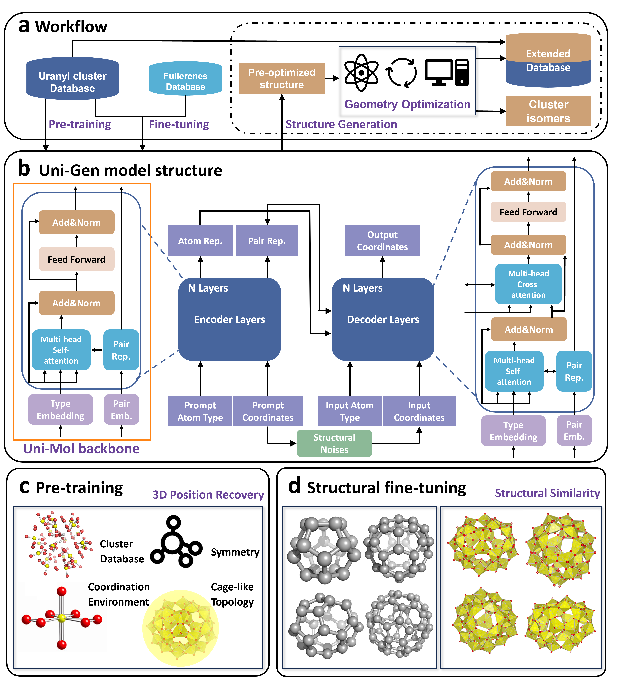

# Deep Learning Guided Generation of Uranyl Peroxide Clusters via Fullerene Inspired Topologies

Bin Li

## 1. Overview
The Uni-Gen model is a deep three-dimensional generative model pre-trained on a large uranyl peroxide database and fine-tuned for generation from fullerene to uranyl peroxide clusters. Built on the Uni-Mol framework, Uni-Gen employs a SE(3)-equivariant transformer to jointly encode atomic types and coordinates, avoiding errors from local approximations. Through a two-stage training process incorporating key structural features—such as fixed coordination, cage-like geometry, and high atomic density—Uni-Gen captures the complexity of these clusters while maintaining generalization. By leveraging topological similarities to fullerenes, Uni-Gen is able to extrapolate these patterns to the more complex uranyl peroxide systems, resulting in stable and geometrically plausible cluster structures.


## 2. Installation

Users can easily install the requirements by:
```
pip install -r requirements.txt
```
For unicore packages, users can go to [Uni-Core](https://github.com/dptech-corp/Uni-Core) for detailed installation guidance.

## 3. Usage

We divide the entire program into four modules:

1. **Dataset generation** – [`prepare_data.py`](./prepare_data.py)  
2. **Model training** – [`train.py`](./train.py)  
3. **Model testing** – [`test.py`](./test.py)
4. **Model inference** – [`infer.py`](./infer.py)


You can easily run each module from the command line. Use the `-h` flag with any script to view its available parameters and usage options.

## 4. Data availability
All the data to train the model and the trained model parameters for uranyl peroxide generation are available at Zenodo (10.5281/zenodo.15241895).

## 5. License
This project is licensed under the terms of the MIT license. See [LICENSE](./LICENSE) for additional details.
